# ChatBot using Amazon Lex

Amazon Lex is a service provided by AWS (Amazon Web Services) that allows
developers to build conversational interfaces using voice and text.

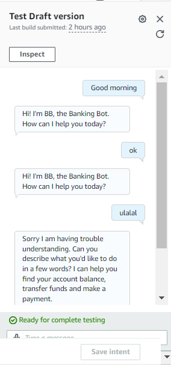

## Setting up a Lex chatbot

First, search for Amazon Lex in AWS console.

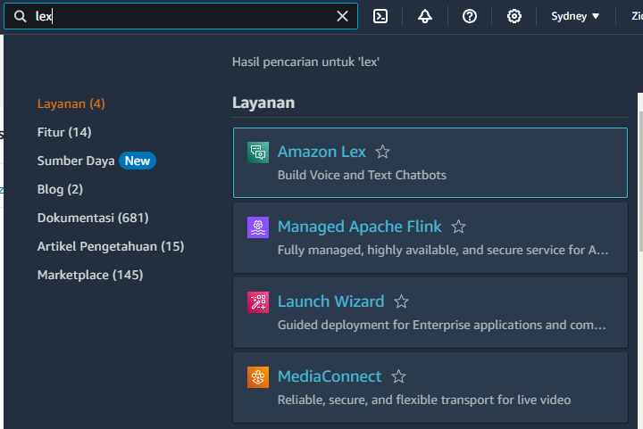

Next, I setup the bot permission with this configuration.

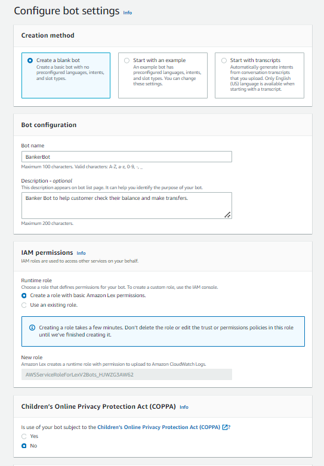

This configuration is to make sure that the chatbot can access other AWS Service.

After I click next, this is the other configuration.

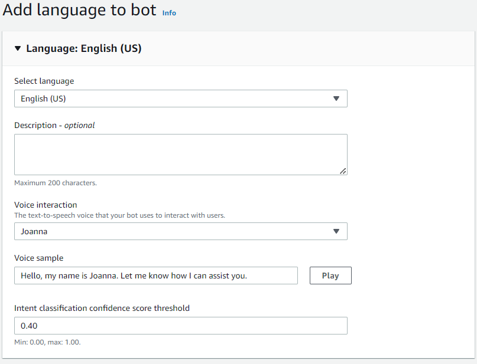

The `intent classification confidence score` I kept at default value
of 0.40. This means that my chatbot need at least 40% confident before
answering the user. If it's under 40%, it will throw an error message.

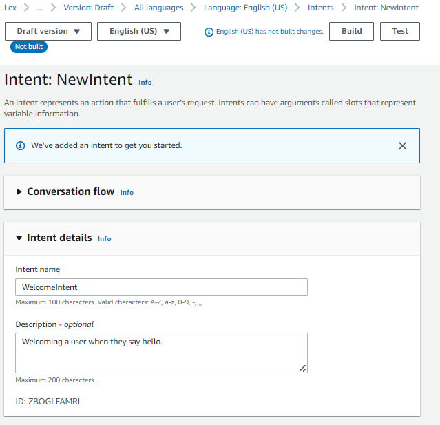

## Intents

Intents are what the user is trying to achieve in their conversation with the
chatbot.

First, I setup `WelcomeIntent`. Go to `Sample utterances` section, then I input all the possible things that customer gonna input when first interacting with the chatbot.

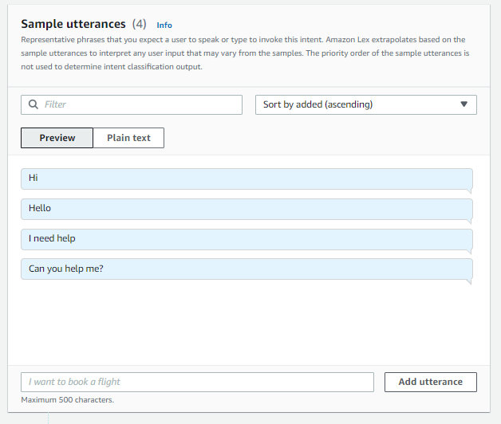

Next, scroll down, until I found `Closing response` section, in which I create the message for the response of the intent.

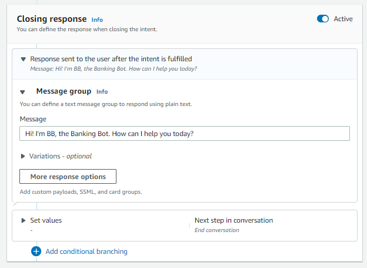

Then, in the top right, I press `Build`, wait for 30 seconds, then I press `Test`.

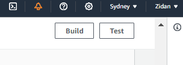

Now, I can test the chatbot. And it's seems pretty good.

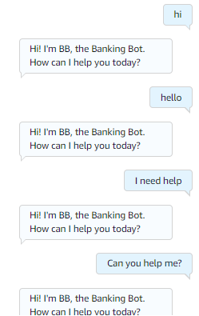

But, when I try to enter other words but also still kinda like a greetings, it's give back an error response.

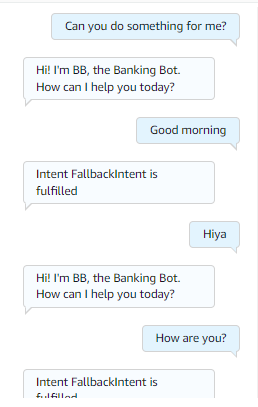

This error message occurred
because the chatbot not confident on what's the intent of the user.

To solve that, let's use the `FallbackIntent` feature!

## FallbackIntent

FallbackIntent is a default intent in every chatbot that gets triggered if your
chatbot has a confidence score below 40% for all the intents I defined.

With configuring the `FallbackIntent` it will improve the user experience with the chatbot.

To configure FallbackIntent, I go to "FallbackIntent" tabs and then in the
"Closing response" section I set the response message when the
"FallbackIntent" is triggered.

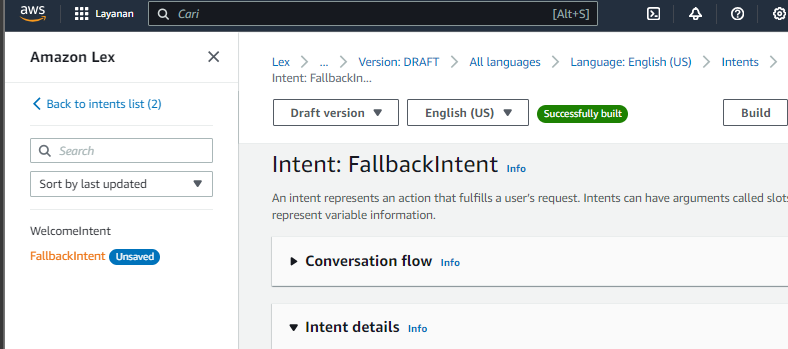

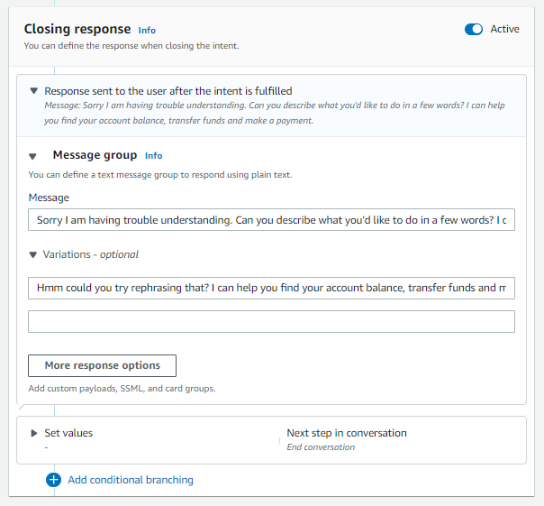

I also added variations! What this means for an end user is will give a dynamic
range of responses, making them sound more conversational!

Now I test it again, and the chatbot is working beautifully!

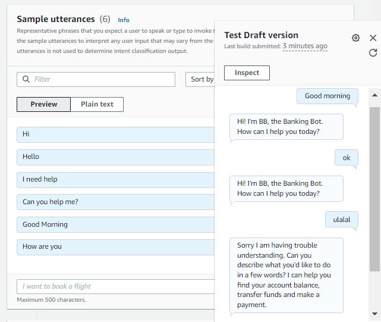